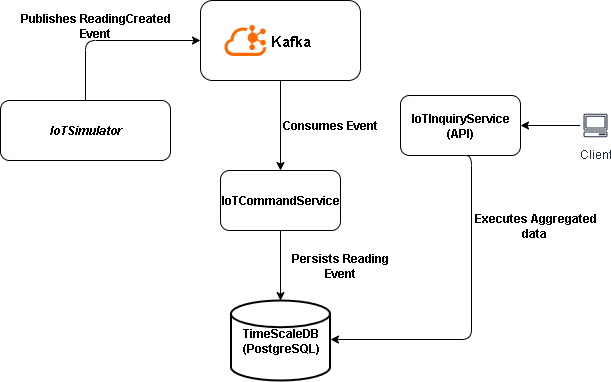

## Architectural Justification: IoT Data Processing System

### 1. Overview

This document outlines the architectural approach and technology choices for the IoT Data Processing System. The primary goal was to build a scalable, resilient, and maintainable pipeline for ingesting, storing, and querying continuous data streams from IoT devices.

The chosen solution is an **event-driven architecture** based on the **Command Query Responsibility Segregation (CQRS)** pattern. The system is logically separated into distinct services for handling writes (commands) and reads (queries), ensuring high performance and independent scalability for each concern. The core services are designed using **Hexagonal Architecture** principles to separate business logic from technology-specific implementation details.

---
### 2. Architectural Approach

The system's data flow is designed to be asynchronous and decoupled, which is essential for handling continuous data streams in a scalable manner.

The data flow is as follows:
1.  **IoT Simulator**: A data-driven, configurable component that simulates multiple IoT devices, generating new readings every second.
2.  **Apache Kafka**: The simulator publishes readings as events to a central Kafka topic. This message broker acts as a persistent, high-throughput buffer, decoupling the data producer from the consumers.
3.  **IoT Command Service**: This service is the "write side" of our CQRS pattern. It subscribes to the Kafka topic, consumes the reading events, and is solely responsible for validating and persisting them into the database.
4.  **TimescaleDB**: A time-series database built on PostgreSQL that serves as our primary data store. It is optimized for the high-volume, timestamped nature of IoT data.
5.  **IoT Query Service**: This is the "read side" of our CQRS pattern. It provides a secure, stateless REST API for clients to query aggregated data (e.g., AVG, MEDIAN) from the database.

This separation ensures that a high volume of incoming data (writes) does not degrade the performance of analytical queries (reads), and vice versa.

---
### 3. Technology Stack & Justification

The technology stack was chosen to align with the assignment's requirements for a Java-based, open-source solution that is both scalable and maintainable.

* **Core Framework: Spring Boot 3 & Java 21**
    * **Justification**: Spring Boot provides an opinionated and highly productive environment for building standalone applications. Its vast ecosystem includes first-class support for all the technologies used in this project (Kafka, JPA, Security). Using a modern LTS version of Java provides access to performance improvements and modern language features.

* **Data Pipeline: Apache Kafka**
    * **Justification**: For a continuous stream of IoT data, a simple message queue is insufficient. Kafka was chosen for its strengths as a distributed streaming platform. It provides **high throughput**, **fault tolerance**, and **data persistence** (messages are not lost if a consumer is down). This makes it the ideal backbone for a scalable ingestion pipeline and ensures the system is resilient.

* **Data Persistence: TimescaleDB (on PostgreSQL)**
    * **Justification**: A standard relational database is not optimized for time-series data. TimescaleDB was chosen because it combines the reliability and familiarity of PostgreSQL with the performance of a true time-series database. Its key advantages for this project include:
        * **Automatic Partitioning**: It automatically partitions data by time, making queries on specific timeframes extremely fast.
        * **Optimized Functions**: It provides specialized SQL functions like `percentile_cont()` for efficient median calculation, which is a requirement of the query service.

* **System Resilience: Spring Retry**
    * **Justification**: To handle transient failures, such as a temporary network issue or a service starting before its dependencies are ready, Spring Retry was implemented. It is used in the `iot-simulator` to automatically retry sending messages if Kafka is unavailable, and in the `iot-command-service` to retry database writes on transient errors. This makes the system more robust and self-healing.

* **Testing Suite: JUnit 5, Mockito, Testcontainers, and Embedded Kafka**
    * **Justification**: A multi-layered testing strategy was employed to ensure reliability.
        * **Unit Tests (Mockito)**: Used to test business logic in isolation.
        * **Integration Tests (Testcontainers & Embedded Kafka)**: The most crucial part of the strategy. Instead of mocking dependencies, we use Testcontainers to spin up real PostgreSQL/TimescaleDB instances and an embedded Kafka broker. This provides high-fidelity tests that prove the application works correctly with its actual dependencies.

---
### 4. Code & Design Principles

* **Hexagonal Architecture (Ports & Adapters)**: Both the command and query services were designed using this pattern. This cleanly separates the core application logic (the "inside") from infrastructure concerns like the web controller, Kafka listeners, and database repositories (the "outside"). This makes the core logic highly testable and independent of specific technologies.
* **Specification Pattern**: The query service uses the Spring Data JPA Specification pattern to build dynamic, type-safe database queries. This avoids error-prone string concatenation and creates reusable, composable query components.

---
### 5. Known Limitations

* **Shared Data Model for CQRS**: For this prototype, both the command and query services operate on the same database table (`readings_command`). In a production system under heavy load, this would be evolved into a true CQRS pattern with a separate, denormalized read model (e.g., a pre-aggregated table) to achieve maximum query performance.
* **Simple Security**: The query service uses in-memory HTTP Basic Authentication. This is sufficient to demonstrate the security requirement but would be replaced in a production environment with a more robust solution like OAuth2/JWT and an external identity provider.
* **String-based Grouping**: The sensor grouping logic is implemented using a simple comma-separated string in the database. While functional, a production system would benefit from a normalized relational model (e.g., `sensors`, `groups`, and `sensor_groups` tables) for better query performance and data integrity.
* **No Dead-Letter Queue (DLQ)**: The Kafka consumer and database retry logic currently log an error and discard the message after all retries fail. A production system would implement a Dead-Letter Queue to store these failed messages for later analysis and reprocessing.